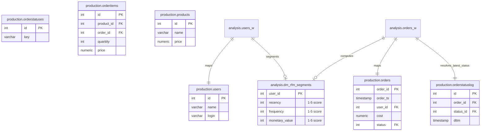

# RFM Customer Segmentation DWH Mart

A self-contained, reproducible Data Warehouse (DWH) project implementing **RFM (Recency, Frequency, Monetary Value) Customer Segmentation** in PostgreSQL.

---

## 1. Business Context

**RFM (Recency, Frequency, Monetary Value)** is a classic database marketing analysis model used to evaluate customer behavior and segment a user base:
- **Recency (R)**: How recently did the customer place an order? (High score = active recently)
- **Frequency (F)**: How many completed orders did they make? (High score = loyal/frequent buyer)
- **Monetary Value (M)**: How much total revenue did they generate? (High score = high spender)

This project segments customers on a **1 to 5 scale** for each metric using statistical percentiles (`NTILE(5)`). Marketing teams can query this analytical mart to run targeted campaigns:
- **VIP Customers (5-5-5)**: High-value, frequent, and recently active.
- **Churn Risk (1-5-5)**: Loyal high spenders who haven't purchased in a long time.
- **New Prospects (5-1-1)**: Reached out recently, but low spend/frequency.

---

## 2. Schema Architecture & Lineage

The data pipeline extracts raw transactional tables from the operational `production` schema, processes them via compatibility views in the `analysis` schema (to isolate analytical models from upstream transactional changes), and loads them into a unified analytical datamart.



---

## 3. SQL Optimization & DWH Design

### CTE-based Single Query vs. Physical Temp Tables
*   **Before**: The pipeline was split into 4 separate SQL files creating physical staging tables (`tmp_rfm_recency`, etc.) and inserting rows step-by-step. This generated unnecessary disk writes, left orphaned temp tables in the schema, lacked atomic transaction guarantees, and suffered from duplicate primary keys upon rerun due to missing `TRUNCATE` logic.
*   **After**: The pipeline is consolidated into a single atomic `INSERT INTO ... SELECT` statement leveraging Common Table Expressions (**CTEs**) and window functions:
    - **Resource Efficiency**: Calculations run entirely in database memory, saving disk I/O.
    - **Preservation of 0-order Users**: Uses a `LEFT JOIN` from `users_w` to `orders_w` to ensure that customers with 0 orders remain in the mart (falling into the lowest Recency/Frequency/Monetary percentiles) rather than being dropped.
    - **Idempotency**: Truncates target DWH mart first before re-populating, ensuring a clean state.

Showcased Query (`datamart_query.sql`):
```sql
TRUNCATE TABLE analysis.dm_rfm_segments;

INSERT INTO analysis.dm_rfm_segments (user_id, recency, frequency, monetary_value)
WITH user_orders AS (
    SELECT 
        u.id AS user_id,
        MAX(CASE WHEN o.status = 4 THEN o.order_ts END) AS last_order_ts,
        COUNT(CASE WHEN o.status = 4 THEN o.order_id END) AS order_count,
        COALESCE(SUM(CASE WHEN o.status = 4 THEN o.cost END), 0) AS total_spend
    FROM analysis.users_w u
    LEFT JOIN analysis.orders_w o 
      ON u.id = o.user_id 
     AND o.order_ts >= '2022-01-01 00:00:00.000'
    GROUP BY u.id
),
rfm_scores AS (
    SELECT 
        user_id,
        NTILE(5) OVER (ORDER BY last_order_ts ASC NULLS FIRST) AS recency,
        NTILE(5) OVER (ORDER BY order_count ASC) AS frequency,
        NTILE(5) OVER (ORDER BY total_spend ASC) AS monetary_value
    FROM user_orders
)
SELECT user_id, recency, frequency, monetary_value
FROM rfm_scores;
```

---

## 4. Local Execution & Simulation Guide

This project is fully self-contained. Using Docker and a Python simulation script, you can spin up the database, generate a realistic order dataset, run the pipeline, and inspect the results.

### Prerequisites
- Docker & Docker Compose
- Python 3.8+

### Setup & Run
1.  **Start PostgreSQL Container**:
    ```bash
    docker-compose up -d
    ```
2.  **Install Python dependencies**:
    ```bash
    pip install -r requirements.txt
    ```
3.  **Run bootstrap and calculation script**:
    ```bash
    python init_and_run.py
    ```
    This script will:
    - Connect to PostgreSQL and create schemas `production` and `analysis`.
    - Generate 100 users, 20 products, 1000 orders spanning 2022, order items, and status logs (transitioning through Created -> Processing -> Delivery -> Closed/Cancelled).
    - Deploy compatibility views and execute the optimized RFM SQL script.
    - Run automated Data Quality Checks.
    - Print the resulting segment distribution matrix in the terminal.

---

## 5. Automated Data Quality Gates

To ensure DWH reliability and protect downstream BI dashboards, the pipeline executes automated validation checks (`data_quality_check.sql`):
1.  **Null Check**: Counts rows with `NULL` segment values. Expected: `0`.
2.  **Range Check**: Counts rows with segment values outside `[1...5]`. Expected: `0`.
3.  **Completeness Check**: Calculates difference in row counts between `users_w` and `dm_rfm_segments`. Expected: `0`.

---

## 6. Sample output
```
RFM Segment Distribution Matrix:
+-----------+-----+-----+-----+-----+-----+
|   recency |   1 |   2 |   3 |   4 |   5 |
|-----------+-----+-----+-----+-----+-----|
|         1 |  10 |   4 |   4 |   2 |   0 |
|         2 |   0 |  10 |   4 |   3 |   3 |
|         3 |   0 |   2 |   7 |   9 |   2 |
|         4 |   0 |   0 |   3 |   4 |  13 |
|         5 |   0 |   0 |   2 |   2 |  16 |
+-----------+-----+-----+-----+-----+-----+
```
*(Shows count of users at each Recency (rows) vs. Frequency (columns) score combination).*
