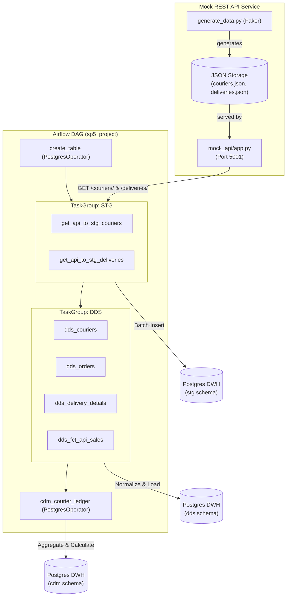
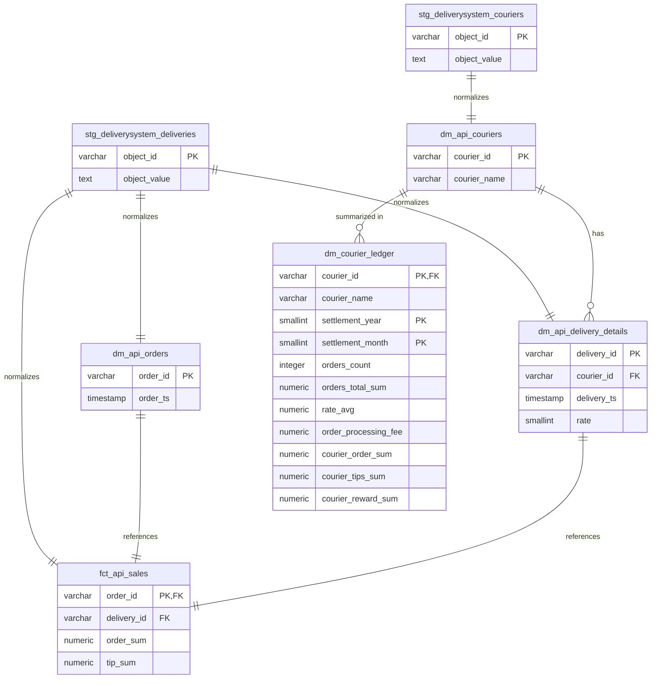

# Courier Payment Ledger DWH Portfolio Project (de-project-4)

This project implements a multi-layer Data Warehouse (DWH) and ETL pipeline coordinated by Apache Airflow. It extracts raw courier profiles and deliveries data from an HTTP API, loads them into a Staging layer, normalizes the dimensions and fact tables into a Core layer (DDS), and constructs an aggregated payment ledger in the Mart layer (CDM) to calculate monthly payouts for couriers.

---

## Architecture & System Flow

The system operates in a self-contained multi-container Docker environment containing Apache Airflow, PostgreSQL, and a mock REST API server serving simulated data.



---

## Data Model & Schema Relationships

The DWH comprises three distinct schemas:
1. **`stg`**: Raw document-store JSON dumps matching API structure.
2. **`dds`**: Normalized relational dimensional structure (3NF).
3. **`cdm`**: Aggregated data mart storing the courier payouts ledger.



---

## Security & Performance Optimizations

1. **Security Vulnerability Resolution (`eval()` Removal)**:
   - The original pipeline used `eval(string)` to parse JSON records read from the database, introducing a severe arbitrary code execution vulnerability. This has been resolved by implementing a safe parsing utility (`ast.literal_eval()` fallback to `json.loads()`).
2. **N+1 Connection Leak Resolution**:
   - The original DAG instantiated a database connection within the loop for every single raw API record. We restructured the task callables to open a single PostgreSQL connection session per task, performing all insertions inside a single transaction.
3. **Airflow Scheduler Optimization**:
   - Moved all `BaseHook.get_connection` metadata lookups inside task execution callables. This prevents Airflow Scheduler parsing loops from constantly opening connections and delaying the scheduler.
4. **Data Corruption Fix in SQL Mart Query**:
   - Fixed a critical column-ordering mismatch where `rate_avg` (numeric) was being inserted into `orders_count` (integer), shifting and corrupting all metrics. The columns in `SELECT` now explicitly align with the `INSERT INTO` columns.
   - Replaced complex nested `CASE` statements with a clean, standard `GREATEST` statement, securing calculations against edge cases when ratings or values exactly hit pricing thresholds.

---

## Setup & Running Guide

### 1. Pre-generate Mock Data
Before starting containers, generate the simulated couriers and deliveries datasets using Faker:
```bash
python mock_api/generate_data.py
```

### 2. Start the Environment
Deploy the multi-container setup containing Airflow, Postgres, and the HTTP Mock API:
```bash
docker compose up -d
```
Verify all containers (`de_project_4_postgres`, `de_project_4_airflow_init`, `de_project_4_airflow`, `de_project_4_mock_api`) are healthy:
```bash
docker compose ps
```

### 3. Trigger the DAG
1. Navigate to the Airflow Webserver at `http://localhost:8080` (credentials: `admin`/`admin`).
2. Unpause and trigger the `sp5_project` DAG.
3. Wait for all tasks to complete successfully.

### 4. Run Data Quality Checks
Query the PostgreSQL database to verify data integrity:
```bash
docker exec -it de_project_4_postgres psql -U de_user -d de_db -f /opt/airflow/dags/../../data_quality_check.sql
```
*(Alternatively, execute the queries in [data_quality_check.sql](file:///c:/Users/m5612/OneDrive/Obsidian_vault/projects/Data_engineer_projects/de-project-4/data_quality_check.sql) in any SQL client).*

---

## Clean Up
To tear down the containers and clear volumes:
```bash
docker compose down -v
```
