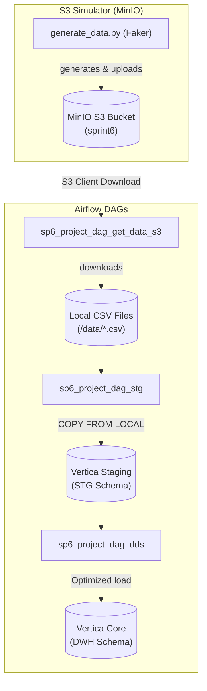

# Vertica Data Vault 2.0 analytical DWH (de-project-5)

This project builds an analytical Data Warehouse (DWH) based on Vertica utilizing the **Data Vault 2.0** storage model (Hubs, Links, and Satellites). It implements incremental ETL pipelines coordinated by Apache Airflow. Data is extracted from an S3 bucket (simulated locally using MinIO), processed through staging layers, and populated into the Data Vault core.

---

## System Architecture & Data Flow

The system runs in a local multi-container Docker environment containing Apache Airflow, Vertica Community Edition, and a local MinIO bucket acting as the cloud S3 storage.



---

## Data Vault 2.0 Core Schema

The core schema (`DWH`) utilizes Hubs (entity keys), Links (many-to-many relationships), and Satellites (temporal/context attributes) for complete audibility and historical tracking.

```mermaid
erDiagram
    h_users {
        bigint hk_user_id PK
        int user_id
        datetime registration_dt
        datetime load_dt
        varchar load_src
    }
    h_groups {
        bigint hk_group_id PK
        int group_id
        datetime registration_dt
        datetime load_dt
        varchar load_src
    }
    h_dialogs {
        bigint hk_message_id PK
        int message_id
        datetime message_ts
        load_dt datetime
        load_src varchar
    }
    l_admins {
        bigint hk_l_admin_id PK
        bigint hk_user_id FK
        bigint hk_group_id FK
        datetime load_dt
        varchar load_src
    }
    l_groups_dialogs {
        bigint hk_l_groups_dialogs PK
        bigint hk_message_id FK
        bigint hk_group_id FK
        datetime load_dt
        varchar load_src
    }
    l_user_message {
        bigint hk_l_user_message PK
        bigint hk_user_id FK
        bigint hk_message_id FK
        datetime load_dt
        varchar load_src
    }
    l_user_group_activity {
        bigint hk_l_user_group_activity PK
        bigint hk_user_id FK
        bigint hk_group_id FK
        datetime load_dt
        varchar load_src
    }
    s_admins {
        bigint hk_admin_id PK, FK
        boolean is_admin
        datetime admin_from
        datetime load_dt
        varchar load_src
    }
    s_group_name {
        bigint hk_group_id PK, FK
        varchar group_name
        datetime load_dt
        varchar load_src
    }
    s_group_private_status {
        bigint hk_group_id PK, FK
        boolean is_private
        datetime load_dt
        varchar load_src
    }
    s_dialog_info {
        bigint hk_message_id PK, FK
        varchar message
        int message_from
        int message_to
        datetime load_dt
        varchar load_src
    }
    s_user_socdem {
        bigint hk_user_id PK, FK
        varchar country
        int age
        datetime load_dt
        varchar load_src
    }
    s_user_chatinfo {
        bigint hk_user_id PK, FK
        varchar chat_name
        datetime load_dt
        varchar load_src
    }
    s_auth_history {
        bigint hk_l_user_group_activity PK, FK
        bigint user_id_from
        varchar event
        datetime event_dt
        datetime load_dt
        varchar load_src
    }

    h_users ||--o{ l_admins : "admin of"
    h_groups ||--o{ l_admins : "has admin"
    h_users ||--o{ l_user_message : "sends"
    h_dialogs ||--o{ l_user_message : "is part of"
    h_groups ||--o{ l_groups_dialogs : "contains"
    h_dialogs ||--o{ l_groups_dialogs : "belongs to"
    h_users ||--o{ l_user_group_activity : "acts in"
    h_groups ||--o{ l_user_group_activity : "tracks activity in"

    l_admins ||--|| s_admins : "details history"
    h_groups ||--|| s_group_name : "details name"
    h_groups ||--|| s_group_private_status : "details privacy"
    h_dialogs ||--|| s_dialog_info : "details text"
    h_users ||--|| s_user_socdem : "details socdem"
    h_users ||--|| s_user_chatinfo : "details chatname"
    l_user_group_activity ||--o{ s_auth_history : "tracks historical events"
```



---

## Optimization & Security Highlights

1. **MPP Duplicate Load Query Optimization**:
   - The original loading statements used `WHERE hash_key NOT IN (SELECT hash_key FROM target)`. In MPP databases like Vertica, `NOT IN` queries with subqueries execute poorly due to Cartesian-like plans. These have been refactored to standard `WHERE NOT EXISTS (SELECT 1 FROM target WHERE ...)` joins, which utilize hash joins for faster deduplication.
2. **Airflow Connection Isolation**:
   - Resolved top-level Airflow connection bottlenecks by moving connection and variable retrievals inside the task callables, ensuring the scheduler does not block on every parse tick.
3. **Idempotence & Safety**:
   - Updated DDL scripts to use `CREATE TABLE IF NOT EXISTS` and staged table load tasks to execute `TRUNCATE` before copying, allowing safe and clean pipeline restarts.
   - Enforced TaskGroup dependencies during table creations, guaranteeing parent tables (Hubs/Staging) are created before child tables (Links/Satellites) attempt to bind foreign key constraints.
4. **Dynamic Schema Prefixes**:
   - The student-specific Yandex schema prefixes (e.g. `STV202311131`) have been parameterized to read from an Airflow Variable `VERTICA_SCHEMA_PREFIX` (defaulting to `stv202311131` in lowercase). This allows the code to run in any database schema without changes.

---

## Setup & Running Guide

### 1. Start the Environment
Deploy the multi-container setup containing Airflow, Vertica Community Edition, and MinIO:
```bash
docker compose up -d
```
Verify that all containers (`de_project_5_vertica`, `de_project_5_minio`, `de_project_5_airflow`) are healthy.

### 2. Generate and Upload Mock Data
Once MinIO is up and healthy, run the simulator script on the host to generate the datasets and upload them into MinIO:
```bash
python mock_data/generate_data.py
```

### 3. Run the ETL Pipeline
1. Navigate to the Airflow Webserver at `http://localhost:8080` (admin/admin).
2. Unpause the following DAGs and trigger them sequentially:
   - **`sp6_project_dag_get_data_s3`**: Fetches the CSV datasets from local MinIO to `/data/`.
   - **`sp6_project_dag_stg`**: Creates the staging schema/tables and performs bulk copies.
   - **`sp6_project_dag_dds`**: Normalizes the staging tables and loads them into Data Vault Hubs, Links, and Satellites.

### 4. Run DWH Quality Checks
Access your Vertica container command line to run quality gate tests:
```bash
docker exec -it de_project_5_vertica /opt/vertica/bin/vsql -U dbadmin -f /data/../data_quality_check.sql
```
*(Alternatively, execute [data_quality_check.sql](file:///c:/Users/m5612/OneDrive/Obsidian_vault/projects/Data_engineer_projects/de-project-5/data_quality_check.sql) in any Vertica SQL editor).*
