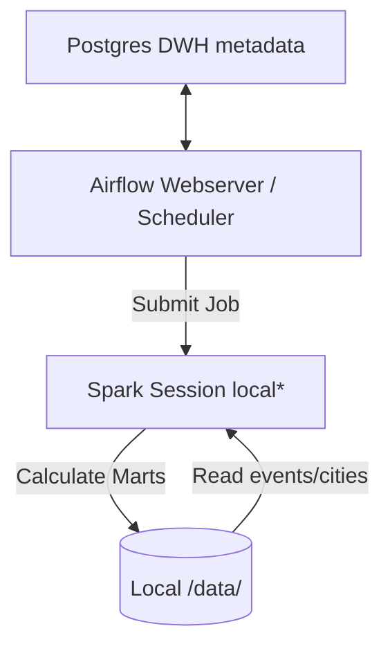

# DWH Data Lake & PySpark Geo-Analytics (de-project-6)

This project implements a scalable **Data Lake geo-analytics pipeline** using Apache Airflow and PySpark (running locally in standalone mode). It processes user events (messages, reactions, subscriptions) and geo-coordinates to generate analytical data marts for targeted friend recommendations and user travel patterns in Australia.

---

## System Architecture

The local development environment is containerised via Docker:
- **Apache Airflow 2.7.2** orchestrates the execution of PySpark scripts.
- **Spark 3.4.1** (Standalone mode within the Airflow container) processes Parquet datasets.
- **PostgreSQL 15** acts as the metadata store for Apache Airflow.
- **Local Mapped Storage (`./data/`)** simulates the Data Lake filesystem (HDFS-like paths).



---

## Analytics Marts Description

The pipeline processes event coordinates against Australian city centroids (via Great-Circle distance calculations) to populate three distinct Parquet marts under `data/mart/`:

1. **Friend Recommendations (`mart_user_rec`)**:
   - Suggests friend connections between users who are subscribed to the same channel, have never corresponded with each other, and are located within 1 km of each other (based on their latest message location).
2. **Traveler Analytics (`mart_user_travel_info`)**:
   - Tracks user travel behavior: identifying their home city (defined as the city where the user stayed for more than 27 consecutive days), travel count, total list of visited cities, and local time (based on timezone mappings).
3. **Zone Statistics (`mart_zones`)**:
   - Aggregates activity per city zone: calculating counts of weekly and monthly posts, likes, reactions, and count of new registrations.

---

## Local Setup & Quick Start

To run the pipeline locally, follow these steps:

### Prerequisites
- Docker & Docker Compose installed on your host.
- Python installed on your host (to download the large Spark package).

### Step 1: Pre-download the PySpark Archive (Highly Recommended)
Due to potential network limitations inside Docker container builds on Windows/macOS bridges, download the large PySpark tarball on your host machine first:
```bash
pip download --no-deps -d . pyspark==3.4.1
```
This saves `pyspark-3.4.1.tar.gz` to the project directory, which is copied directly during the Docker image build, completing it in seconds.

### Step 2: Build and Start Services
Start the PostgreSQL metadata database, run Airflow DB migrations, import the Spark connection (`yarn_spark`), and start the Airflow webserver/scheduler:
```bash
docker compose up --build -d
```

### Step 3: Populate Mock Data
Generate the geo-locations and events Parquet data inside the running Airflow container:
```bash
docker exec -it de_project_6_airflow python /opt/airflow/mock_data/generate_data.py
```
This populates:
- `/data/cities/geo` (Australia cities coordinates from the project specification)
- `/data/analytics/events` (mock messages, reactions, and subscriptions)

### Step 4: Run the Airflow DAG
1. Open the Airflow Web UI: [http://localhost:8080](http://localhost:8080)
2. Log in using `admin` / `admin`.
3. Locate the `datalake_project` DAG.
4. **Unpause** the DAG and click **Trigger DAG**.
5. Once completed, verify the generated output parquet files in your host's `./data/mart/` directory.

---

## Refactoring Improvements

Compared to the production deployment templates, the following improvements were introduced for local reproducibility:
- **Dynamic Data Paths**: All HDFS paths are parameterized using a `BASE_DATA_DIR` environment variable (defaults to production HDFS path `/user/mikvolobue/data` but overrides to local volume `/data` during local execution).
- **Environment Isolation**: Production YARN/Hadoop overrides are wrapped in a check `if os.environ.get("ENV") != "local"` to prevent execution failures in standalone Spark environments.
- **Spark Configuration Dynamic Override**: Spark Sessions dynamically initialize the master using the `SPARK_MASTER` env variable (defaulting to production `yarn` but overrides to `local[*]` locally).
- **Bug Fix**: Resolved a critical syntax error in `mart_user_rec.py` where the `today` parameter was missing from the `mart()` caller signature.
