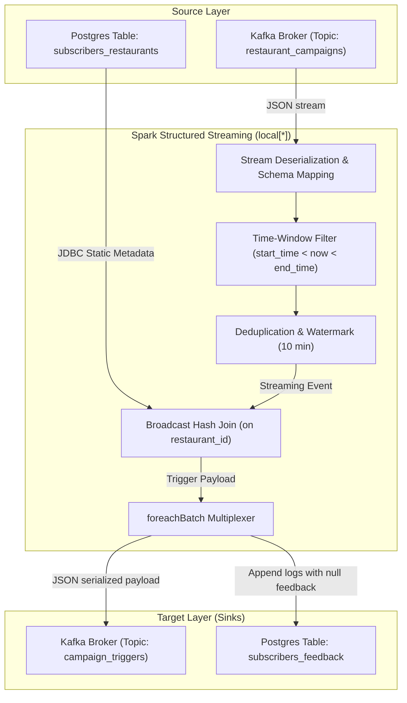

# Real-Time Campaign Notification Service (de-project-7)

A PySpark Structured Streaming application that consumes restaurant promotional campaign events in real-time from an Apache Kafka topic, enriches the stream by joining it with subscriber metadata stored in a PostgreSQL database, writes triggered client notifications back to a target Kafka topic, and appends transaction logs to a PostgreSQL database feedback table.

---

## 1. Lineage & Architecture Flow

The streaming pipeline executes microbatch processing at 25-second intervals. It performs deduplication on the campaign identifier and message creation timestamp, applies watermarking to allow late-arriving events within a 10-minute threshold, and uses a **Broadcast Join** to enrich campaign events with database subscribers.



---

## 2. Database Models & Schema Design

### Staging Subscriber Metadata (`subscribers_restaurants`)
This table acts as the static reference dimension mapping clients to their favorite restaurants.

| Column Name | Data Type | Key / Constraint | Description |
| :--- | :--- | :--- | :--- |
| `id` | `SERIAL` | `PRIMARY KEY` | Auto-incremented unique identifier. |
| `client_id` | `VARCHAR(255)` | `NOT NULL` | Unique identifier of the user/client. |
| `restaurant_id` | `VARCHAR(255)` | `NOT NULL` | Unique identifier of the restaurant. |

### Campaign Trigger Logs (`subscribers_feedback`)
This table logs the notification delivery triggers. Initially, the feedback column is populated with `NULL` (awaiting user action).

| Column Name | Data Type | Description |
| :--- | :--- | :--- |
| `id` | `SERIAL PRIMARY KEY` | Auto-incremented unique event identifier. |
| `restaurant_id` | `VARCHAR(255)` | The source restaurant that launched the promotion. |
| `adv_campaign_id` | `VARCHAR(255)` | The unique identifier of the marketing campaign. |
| `adv_campaign_content`| `TEXT` | Message text sent to the client. |
| `adv_campaign_owner` | `VARCHAR(255)` | Business owner name of the campaign. |
| `adv_campaign_owner_contact`| `VARCHAR(255)` | Contact email/number of the owner. |
| `adv_campaign_datetime_start`| `BIGINT` | Epoch timestamp of campaign start. |
| `adv_campaign_datetime_end` | `BIGINT` | Epoch timestamp of campaign end. |
| `datetime_created` | `BIGINT` | Event creation timestamp. |
| `client_id` | `VARCHAR(255)` | Target client who favored the restaurant. |
| `trigger_datetime_created` | `TIMESTAMP` | Timestamp when Spark generated the notification. |
| `feedback` | `TEXT` | User feedback log (defaults to `NULL`). |

---

## 3. Streaming Logic & Optimizations

- **Dynamic Environment Parameterization**: Environment variables (`ENV`, `POSTGRES_URL_IN`, `POSTGRES_URL_OUT`, `KAFKA_BOOTSTRAP_SERVERS`) isolate local mock settings from Yandex Cloud production hosts.
- **Deduplication and Watermarks**: Drops duplicate campaigns using `.dropDuplicates(["adv_campaign_id", "datetime"])` within a 10-minute `.withWatermark("datetime", "10 minutes")` window.
- **Broadcast Join**: Speeds up stream-static joins using `F.broadcast(subscribers_data)` to eliminate shuffles of the static metadata table.
- **Robust Recovery**: Includes `.option("checkpointLocation", checkpoint_dir)` to enable fault-tolerant processing and ensure exactly-once semantics.

---

## 4. Local Execution & Quick Start

### 1. Spin up the local services
Start PostgreSQL, ZooKeeper, and the Kafka broker:
```bash
docker compose up --build -d
```

### 2. Publish Mock Data
Run the generator script inside the Spark container. This creates topics, inserts subscribers into PostgreSQL, and sends mock campaign messages to Kafka:
```bash
docker compose exec spark-streaming python mock_data/generate_data.py
```

### 3. Verify Target Outputs
Wait for the query trigger cycle to finish, then check database writes:
```bash
docker compose exec postgres psql -U jovyan -d de -c "select id, restaurant_id, adv_campaign_id, client_id, trigger_datetime_created from subscribers_feedback;"
```

Verify that the triggers were serialized and written to the output Kafka topic:
```bash
docker compose exec kafka kafka-console-consumer --bootstrap-server localhost:9092 --topic campaign_triggers --from-beginning --max-messages 5
```

### 4. Shutdown environment
Stop and clean up containers and networks:
```bash
docker compose down
```
