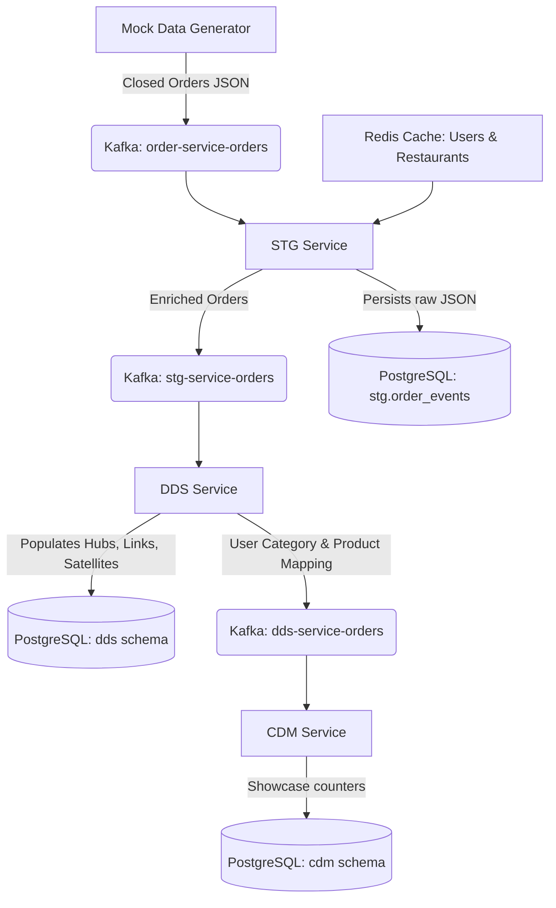

# DWH Microservice Architecture Pipeline (Project 8)

This project builds a real-time Data Warehouse (DWH) pipeline using a microservice architecture to ingest orders, enrich them with metadata, build a Data Vault modeling layer, and compute user showcase statistics.

## Pipeline Architecture



### Components:
1. **STG Service**: Ingests incoming orders from Kafka, resolves user names and restaurant menus from Redis, formats the items, publishes enriched order payloads to Kafka, and saves the raw records to `stg.order_events`.
2. **DDS Service**: Consumes from the STG output topic, implements a **Data Vault 2.0** model (Hubs, Links, and Satellites) inside PostgreSQL, and publishes user-product mappings to Kafka.
3. **CDM Service**: Consumes user-product mappings and maintains real-time user-category and user-product showcases counters.

---

## Local Development & Environment Setup

This project is fully containerised and runs locally using Docker Compose, spinning up PostgreSQL, Redis, ZooKeeper, Kafka, and the three microservice runners.

### Prerequisites
- Docker & Docker Compose
- Python 3.10+ (for running the mock stream locally)

### 1. Build and Run the Stack
Run the following command from the project root:
```bash
docker compose up --build -d
```
This command starts all infrastructure services and builds the microservice runners. It also runs `sql/init.sql` to initialize all schemas and tables in PostgreSQL.

### 2. Stream Mock Data
Install host dependencies and execute the generator:
```bash
pip install redis confluent-kafka
python mock_data/generate_data.py
```
This script will:
1. Populates Redis with mock users and restaurants (with menus).
2. Publishes 5 mock closed orders to the `order-service-orders` topic.

---

## Verification Queries

You can execute queries inside the PostgreSQL database container to verify correct data processing across the layers:

### 1. STG Layer
Verify that raw orders are saved:
```sql
SELECT * FROM stg.order_events;
```

### 2. DDS Layer (Data Vault)
Verify that Hubs and Satellites are correctly created and updated:
```sql
-- Count users and orders
SELECT COUNT(*) FROM dds.h_user;
SELECT COUNT(*) FROM dds.h_order;

-- Check order statuses
SELECT * FROM dds.s_order_status;
```

### 3. CDM Layer (Storefront Showcases)
Verify that the counters are incremented successfully:
```sql
-- User product showcase counters
SELECT * FROM cdm.user_product_counters;

-- User category showcase counters
SELECT * FROM cdm.user_category_counters;
```
