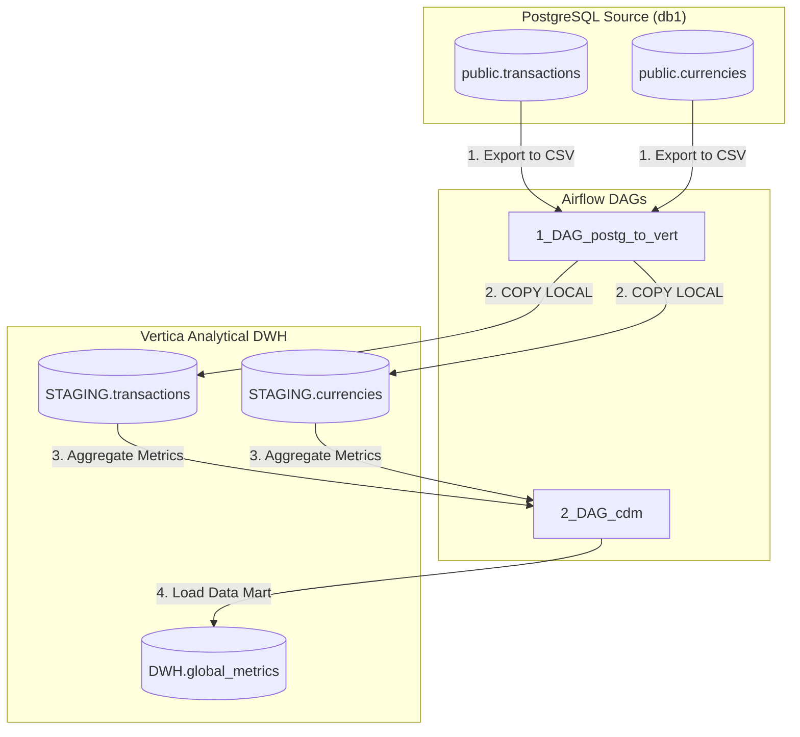

# Analytical DWH ETL Pipeline (de-project-final)

This is the final portfolio project building an analytical Data Warehouse (DWH) based on **Vertica** and **PostgreSQL** with pipeline orchestration by **Apache Airflow**.

The system ingests international transaction activity and currency exchange rates from a transactional PostgreSQL source, stores them in a Vertica staging layer (`STAGING` schema), and aggregates key business indicators into a clean Data Mart (`DWH.global_metrics`) for executive reporting.

---

## System Architecture & Data Flow

The system runs in a local multi-container Docker environment containing Apache Airflow, PostgreSQL (source), and Vertica Community Edition (analytical DWH).



---

## Local Development & Infrastructure Setup

### 1. Provision Containers
Deploy the complete local environment:
```bash
docker compose up -d
```
This starts:
- **PostgreSQL**: Exposes `5432` with database `db1` representing the production transactional source.
- **Vertica**: Exposes `5433` and `5444` running the database engine.
- **Apache Airflow**: Exposes Web UI on `http://localhost:8080` (admin/admin credentials). Automatically boots up with pinned Vertica provider packages (`3.8.0`) matching Airflow `2.7.2` runtime.

### 2. Populate Source Database
Run the provided mock data generator to initialize PostgreSQL schemas and write 500+ realistic transaction and currency records spanning **October 2022**:
```bash
# Copy mock data script to the Airflow container (which has psycopg2 installed)
docker cp ./mock_data/generate_data.py de_final_airflow:/opt/airflow/generate_data.py

# Run the generator
docker exec de_final_airflow python /opt/airflow/generate_data.py
```

### 3. Airflow Connection Configuration
Run the following commands inside the Airflow webserver container to register database connections:
```bash
# PostgreSQL Connection
docker exec de_final_airflow airflow connections add postgres_conn \
    --conn-type postgres \
    --conn-host postgres \
    --conn-port 5432 \
    --conn-login student \
    --conn-password student_password \
    --conn-schema db1

# Vertica Connection
docker exec de_final_airflow airflow connections add vertica_conn \
    --conn-type vertica \
    --conn-host vertica \
    --conn-port 5433 \
    --conn-login dbadmin \
    --conn-password vertica_password \
    --conn-schema docker \
    --conn-extra '{"host": "vertica", "port": 5433, "user": "dbadmin", "password": "vertica_password", "database": "docker", "autocommit": true}'
```

---

## Pipeline Implementation & Enhancements

### 1. Anti-Pattern Refactoring
- **Deferred Hook Lookups**: Moved connection lookups (`get_conn()`) out of the DAG parsing context into the task runtime callables. This resolved scheduler latency and eliminated socket leakage.
- **Transaction Commits**: Added explicit `commit()` calls on all SQL statements executed in `data_transfer.py` to prevent inserts and deletes from being rolled back by the Vertica engine when autocommit is not set.
- **Relative Path Resolution**: Updated SQL reader paths to be determined relative to the file location, making execution directories directory-independent.

### 2. Dynamically Parameterised Vertica Schema
Instead of hardcoding student schema names (like `STV202311131`), we dynamically lookup the prefix via Airflow Variable `VERTICA_SCHEMA_PREFIX` (defaults to `stv202311131`). DDL setups and INSERT/DELETE statements are formatted on the fly before execution:
```python
schema_prefix = Variable.get("VERTICA_SCHEMA_PREFIX", "stv202311131").lower()
formatted_script = sql_script.replace('STV202311131', schema_prefix)
```

### 3. Task Idempotency
To prevent duplicate records on task retries or manual execution clears, the pipeline runs cleanup queries before writing:
- **Staging**: Deletes daily records based on `transaction_dt::date` or `date_update::date` prior to calling `COPY LOCAL`.
- **DWH / Mart**: Removes daily showcases matching `date_update` before calling `INSERT INTO ... SELECT`.

---

## Verification Results

Once DAGs are unpaused, catchup executes all daily jobs for October 2022.

### 1. Ingestion Metrics (Vertica Staging)
Staging tables successfully ingested all 500 transactions and 93 daily currency exchange rates:
```sql
dbadmin=> SELECT COUNT(*) FROM stv202311131__STAGING.transactions;
 COUNT 
-------
   500

dbadmin=> SELECT COUNT(*) FROM stv202311131__STAGING.currencies;
 COUNT 
-------
    93
```

### 2. Mart Showcase Ingestion (`DWH.global_metrics`)
Running a SELECT query on `stv202311131__DWH.global_metrics` yields daily aggregated currency metrics computed in dollars:
```sql
dbadmin=> SELECT * FROM stv202311131__DWH.global_metrics ORDER BY date_update LIMIT 5;
 date_update | currency_from | amount_total | cnt_transactions | avg_transactions_per_account | cnt_accounts_make_transactions 
-------------+---------------+--------------+------------------+------------------------------+--------------------------------
 2022-10-01  |           840 |    259455.00 |                5 |                         1.00 |                              5
 2022-10-01  |           949 |      2703.35 |                2 |                         1.00 |                              2
 2022-10-01  |           978 |     62964.30 |                1 |                         1.00 |                              1
 2022-10-02  |           840 |    161478.00 |                2 |                         1.00 |                              2
 2022-10-02  |           949 |     16755.88 |                6 |                         1.00 |                              6
```
Total records calculated: **86 rows**.
